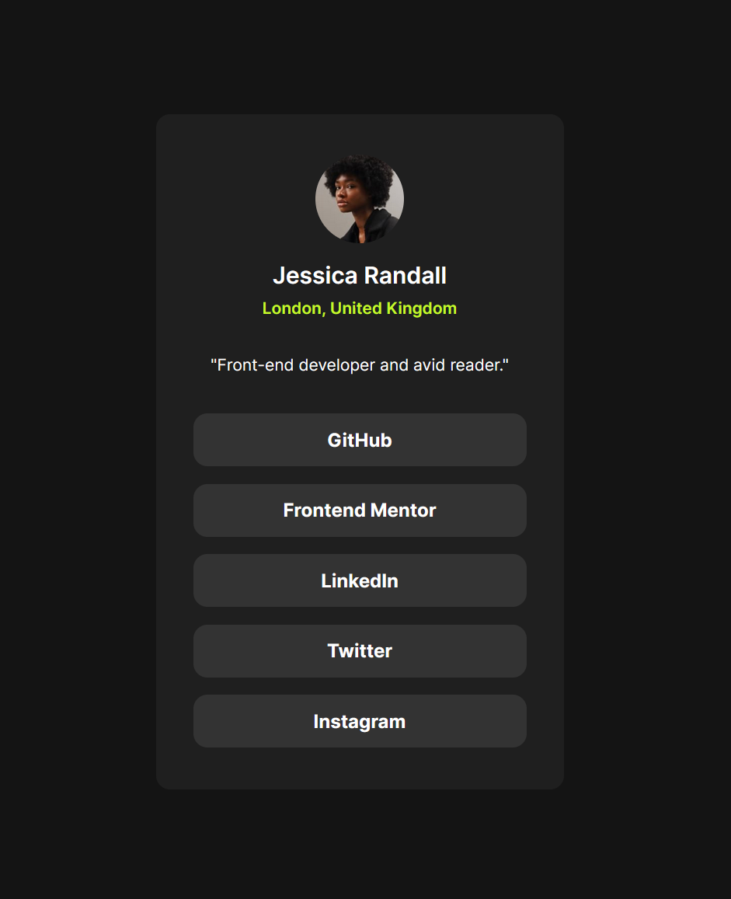

# Frontend Mentor - Social links profile solution

This is a solution to the [Social links profile challenge on Frontend Mentor](https://www.frontendmentor.io/challenges/social-links-profile-UG32l9m6dQ). Frontend Mentor challenges help you improve your coding skills by building realistic projects. 

## Table of contents

- [Overview](#overview)
  - [The challenge](#the-challenge)
  - [Screenshot](#screenshot)
  - [Links](#links)
- [My process](#my-process)
  - [Built with](#built-with)
  - [What I learned](#what-i-learned)
  - [Continued development](#continued-development)
- [Author](#author)

## Overview

### The challenge

Users should be able to:

- See hover and focus states for all interactive elements on the page

### Screenshot



### Links

- Live Site URL: [https://dudamania.github.io/fem-social-links-profile/](https://dudamania.github.io/fem-social-links-profile/)

## My process

### Built with

- CSS custom properties
- Flexbox
- CSS Grid
- Mobile-first workflow
- [Bootstrap](https://getbootstrap.com) - Mobile First Toolkit
- [Sass](https://sass-lang.com/) - CSS Library

### What I learned

Progressed on my knowledge of using rem as font sizes instead of px as to provide a better responsiveness in fonts across mobile and destop layouts.

```css
p {
  font-size: 0.875rem;
}
```

### Continued development

I would like to continue my learning of better responsive css practices, as well as using variables more to make future design changes easier.

## Author

- Website - [Dudley Seddon](https://www.dudleyseddon.com)
- Frontend Mentor - [@dudamania](https://www.frontendmentor.io/profile/dudamania)
- Twitter - [@dudleyseddon](https://www.twitter.com/dudleyseddon)
